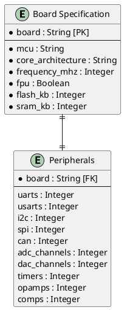

# Design Document: STM32 Workshop Microcontroller Comparison and Overview

This document presents the detailed design, technological choices, and component interfaces for the STM32 Workshop Microcontroller Overview and Comparison project, as derived from the `CONCEPT.md` goals.

---

## 1. System Overview & Architecture Diagram

The system employs a modular architecture featuring decoupled core logic components, standard data structures, and multiple user/machine interfaces (CLI and Documentation Exporter).

```
+-------------------------------------------------------------+
|                     Business Interfaces                     |
|  [CLI User Interface]           [Documentation Generator]   |
+-------------------------------------------------------------+
                               |
                               v
+-------------------------------------------------------------+
|                    Core Application Logic                   |
|                                                             |
|   +-------------------+             +-------------------+   |
|   |                   |             |                   |   |
|   |  Registry Engine  | ----------->| Comparison Engine |   |
|   |                   |             |                   |   |
|   +-------------------+             +-------------------+   |
|             ^                                 |             |
|             |                                 v             |
|   +-------------------+             +-------------------+   |
|   |                   |             |                   |   |
|   |  Data Repository  |             | Recommendation    |   |
|   |                   |             | Engine            |   |
|   +-------------------+             +-------------------+   |
+-------------------------------------------------------------+
                               |
                               v
+-------------------------------------------------------------+
|                      Storage & Assets                       |
|   [Spec Datastore (YAML/JSON)]      [Rendered Assets (MD)]  |
+-------------------------------------------------------------+
```

### 1.1 TOP_ARCHITECTURE.puml Integration
Below is the dynamic rendering of the top-level architecture component diagram:


---

## 2. Technical Component Interfaces

The codebase is structured in Python (as selected in Section 5). The core logic is structured into classes with clear, type-annotated interfaces.

### 2.1 Data Repository (`src/core/repository.py`)
Responsible for finding, reading, parsing, and validating YAML specifications.

```python
from typing import Dict, List, Any
from pydantic import BaseModel

class DataRepository:
    def __init__(self, spec_dir: str):
        self.spec_dir = spec_dir

    def load_all_specs(self) -> List[Dict[str, Any]]:
        """
        Scans spec_dir, parses all yaml files, validates them against the Pydantic schema,
        and returns a list of dictionaries representing valid MCU specifications.
        """
        pass

    def get_spec(self, board_name: str) -> Dict[str, Any]:
        """
        Retrieves and validates the specification for a specific board.
        Raises ValueError if the board is not found.
        """
        pass
```

### 2.2 Registry Engine (`src/core/registry.py`)
Provides metadata querying and single-source-of-truth lookup services for the system.

```python
class RegistryEngine:
    def __init__(self, repository: DataRepository):
        self.repository = repository

    def list_boards(self) -> List[str]:
        """Returns a sorted list of all available board names."""
        pass

    def get_board_details(self, board_name: str) -> Dict[str, Any]:
        """Returns detailed specifications for the specified board name."""
        pass
```

### 2.3 Comparison Engine (`src/core/comparison.py`)
Computes difference matrices and aligns features across selected boards.

```python
class ComparisonResult(BaseModel):
    headers: List[str]                  # List of board names compared
    features: Dict[str, List[Any]]       # Feature name mapped to values in order of headers

class ComparisonEngine:
    def __init__(self, registry: RegistryEngine):
        self.registry = registry

    def compare(self, board_names: List[str]) -> ComparisonResult:
        """
        Compares multiple boards and creates a row-by-row feature matrix.
        Aligns optional features with default values (e.g., None or N/A).
        """
        pass
```

### 2.4 Recommendation Engine (`src/core/recommendation.py`)
Performs constraint-based matching of MCU attributes to user constraints.

```python
class Constraints(BaseModel):
    min_flash_kb: int = 0
    min_sram_kb: int = 0
    min_freq_mhz: int = 0
    requires_fpu: bool = False
    peripherals: List[str] = []

class Recommendation(BaseModel):
    board_name: str
    match_score: float                  # Percentage / score of match
    matched_features: List[str]
    missing_features: List[str]

class RecommendationEngine:
    def __init__(self, registry: RegistryEngine):
        self.registry = registry

    def evaluate(self, constraints: Constraints) -> List[Recommendation]:
        """
        Matches constraints against all registered boards.
        Returns a sorted list of recommendations from best match to worst.
        """
        pass
```

### 2.5 Documentation Generator (`src/core/generator.py`)
Exports data matrices to human-readable Markdown.

```python
class DocGenerator:
    @staticmethod
    def to_markdown_table(comparison_result: ComparisonResult) -> str:
        """
        Transforms a ComparisonResult structure into a Markdown-formatted table.
        """
        pass

    @staticmethod
    def export_report(comparison_result: ComparisonResult, output_path: str) -> None:
        """
        Writes the generated markdown comparison table to the specified output path.
        """
        pass
```

---

## 3. Data Schema & Representation

The specification database resides in `/specification/` as YAML files.

### 3.1 YAML Specification Schema
A Pydantic schema validates every YAML file loaded. Each file has the following format:

```yaml
board: "Nucleo-F446RE"
mcu: "STM32F446RET6"
core:
  architecture: "Cortex-M4"
  frequency_mhz: 180
  fpu: true
memory:
  flash_kb: 512
  sram_kb: 128
peripherals:
  uarts: 4
  usarts: 2
  i2c: 3
  spi: 4
  can: 2
  adc_channels: 16
  dac_channels: 2
  timers: 10
  opamps: 0
  comps: 0
electrical:
  min_voltage: 1.7
  max_voltage: 3.6
```

### 3.2 Database representation
As per `GEMINI.md`, if relational or tabular databases are modeled, they should be drawn as plantUML entities with crowfoot notation. For our local specification datastore, the YAML entities and their properties are represented below:



---

## 4. Command-Line Interface (CLI) Specification

As specified in `GEMINI.md`, every option must be available in both short and long form. The tool is invoked via `src/main.py`.

### 4.1 CLI Interface Layout

```bash
Usage: python src/main.py [OPTIONS] COMMAND [ARGS]...

Options:
  -v, --verbose  Enable verbose debug output.
  -h, --help     Show this message and exit.

Commands:
  list       List all registered STM32 boards.
  show       Show full details of a specific board.
  compare    Compare two or more boards.
  recommend  Recommend a board based on constraints.
  export     Export comparison matrix to Markdown files.
```

### 4.2 Details of Commands and Options

#### 1. `list` Command
*   **Usage**: `python src/main.py list`
*   **Options**: None

#### 2. `show` Command
*   **Usage**: `python src/main.py show [OPTIONS]`
*   **Options**:
    *   `-b, --board TEXT` : Name of the board to inspect (e.g. `Nucleo-F446RE`). [Required]

#### 3. `compare` Command
*   **Usage**: `python src/main.py compare [OPTIONS]`
*   **Options**:
    *   `-b, --board TEXT` : Names of the boards to compare (can be repeated, e.g. `-b Nucleo-F446RE -b Nucleo-C031C6`). [Required]

#### 4. `recommend` Command
*   **Usage**: `python src/main.py recommend [OPTIONS]`
*   **Options**:
    *   `-f, --flash INTEGER` : Minimum flash capacity in KB. [Default: 0]
    *   `-s, --sram INTEGER`  : Minimum SRAM capacity in KB. [Default: 0]
    *   `-m, --freq INTEGER`  : Minimum clock frequency in MHz. [Default: 0]
    *   `-u, --fpu`           : Require Floating Point Unit (FPU). [Flag, Default: False]

#### 5. `export` Command
*   **Usage**: `python src/main.py export [OPTIONS]`
*   **Options**:
    *   `-o, --output PATH` : Target markdown file path for exporting comparison data. [Default: README.md]

---

## 5. Technological Decisions & Alternatives

Below are three critical architectural decisions made for the development and testing stack.

### 5.1 Decision 1: Language & Runtime Stack
*   **Alternative A: Python 3** (Selected)
    *   *Description*: Python 3.x using PyYAML and standard tooling.
    *   *Pros*: Excellent scripting capabilities, rich YAML parser support, simple text and Markdown generation libraries, widely understood by embedded engineers.
    *   *Cons*: Slower execution speed than compiled languages (negligible for 4 boards).
*   **Alternative B: Node.js (TypeScript)**
    *   *Description*: Standard Node runtime with custom TS compilation.
    *   *Pros*: Fast scripting, strong static typing, excellent ecosystem.
    *   *Cons*: Heavy `node_modules` footprint, runtime setup is less common for hardware developers.
*   **Alternative C: Rust**
    *   *Description*: Safe systems programming language compiling to a native binary.
    *   *Pros*: Unmatched performance, static safety guarantees, easily packaging as a single CLI binary.
    *   *Cons*: Steep learning curve, longer development times.

### 5.2 Decision 2: Schema Validation Library
*   **Alternative A: Pydantic v2** (Selected)
    *   *Description*: High-speed data validation and parsing using Python type hints.
    *   *Pros*: Automatic serialization/deserialization, strict type checking, clean declaration patterns, very active ecosystem.
    *   *Cons*: Slower startup time than manual verification (negligible in CLI).
*   **Alternative B: Cerberus**
    *   *Description*: Lightweight, extensible schema validation library for Python.
    *   *Pros*: No complex dependencies, simple dict-based definitions.
    *   *Cons*: Lacks IDE type hinting, does not automatically instantiate object representations.
*   **Alternative C: Manual Validation (Custom Code)**
    *   *Description*: Custom Python parser code to verify YAML dict fields.
    *   *Pros*: Zero external dependencies.
    *   *Cons*: Error-prone, hard to maintain, poor validation error reporting.

### 5.3 Decision 3: CLI Framework
*   **Alternative A: Click (Python CLI creation kit)** (Selected)
    *   *Description*: Composable command-line utility creation kit.
    *   *Pros*: Simplifies argument and option validation, cleanly handles repeated flags (like `-b`), automatically generates help pages, supports standard long/short formats.
    *   *Cons*: Dependency overhead.
*   **Alternative B: argparse (Python Standard Library)**
    *   *Description*: Built-in Python library for writing command-line interfaces.
    *   *Pros*: Included with Python (zero installation/dependencies).
    *   *Cons*: Verbose syntax, less intuitive nested command handling.
*   **Alternative C: Typer**
    *   *Description*: CLI library based on Python type hints, built on Click.
    *   *Pros*: Beautiful output, extremely modern, type-safe command signatures.
    *   *Cons*: Heavy dependency tree (requires Typer + Click + Shell completion packages).

---

## 6. Summary of Discarded Alternatives

To maintain absolute clarity, the following major alternatives evaluated in Section 5 have been discarded and are summarized below:

| Alternative Name | Dimension | Primary Reason for Discarding |
| :--- | :--- | :--- |
| **Node.js (TypeScript)** | Language & Runtime Stack | High node_modules overhead, less common in standard firmware toolchains. |
| **Rust** | Language & Runtime Stack | Higher development overhead and learning curve than necessary for this scope. |
| **Cerberus** | Schema Validation | Lacks strong IDE autocomplete/typing integration; less robust than Pydantic. |
| **Manual Validation** | Schema Validation | Complex to write, hard to maintain, and does not scale if schema rules expand. |
| **argparse** | CLI Framework | Less intuitive subcommand nesting structure, leading to more verbose boilerplates. |
| **Typer** | CLI Framework | Extraneous dependencies beyond basic CLI necessities. |

---

## 7. Build, Deployment & Tooling (HOWTO)

### 7.1 Local Tooling Setup (`src/install.sh`)
As mandated, `src/install.sh` handles setup of all production dependencies:

```bash
#!/usr/bin/env bash
set -euo pipefail

echo "Installing application dependencies..."
pip install --upgrade pip
pip install pyyaml pydantic click
```

### 7.2 Testing Setup (`test/install.sh`)
Testing framework relies on `pytest`. `test/install.sh` installs validation tools:

```bash
#!/usr/bin/env bash
set -euo pipefail

echo "Installing test dependencies..."
pip install pytest pytest-cov
```

### 7.3 CI/CD & RTD Integration
*   **CI/CD Pipeline**: GitHub Action workflows validate specifications, run test suites, check formatting, and build assets on every commit.
*   **ReadTheDocs (RTD)**: Configuration using `.readthedocs.yaml` to trigger automatic generation and hosting from the `main` branch.
